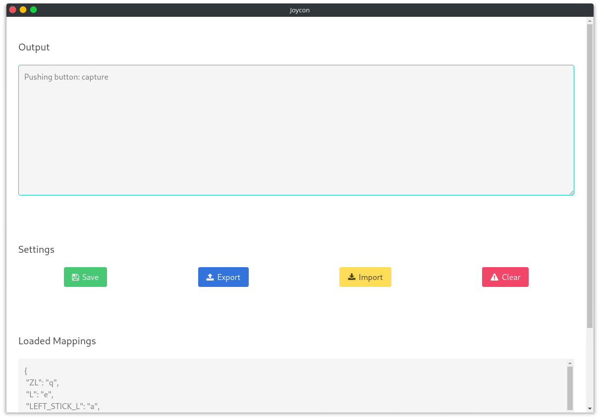

# Fakecon

An electron tool that allows emulating a Nintendo Switch pro controller using [mart1nro/joycontrol](https://github.com/mart1nro/joycontrol)

## Usage

Follow the instructions at [the joycontrol repo](https://github.com/mart1nro/joycontrol) to setup joycontrol. I tested this on a Manjaro system, and it worked fine.

Then, install tmux and tmux, with a window name to 'sw' (Ctrl+B, $, 'sw', enter).

Then, run joycontrol as specified inside the Tmux window, and verify it has connected to your Switch (follow the instructions at [mart1nro/joycontrol](https://github.com/mart1nro/joycontrol))

Finally, launch fakecon. As long as the Fakecon window is focused, input will be captured, and if it corresponds to a valid mapping, it will be sent to joycontrol, which will in turn send it to the Switch.

You may edit the configuration by exporting the JSON, editing it, then importing the JSON. Any changes will be saved, so you do not need to reload the custom JSON mapping each time.

Pressing the clear button will clear the output log on the top of the screen.

The currently loaded key bindings will be printed on the bottom of the screen.

## TODO

- Launch joycontrol from within fakecon
- Have an internal way to rebind keys, instead of modifying the JSON
